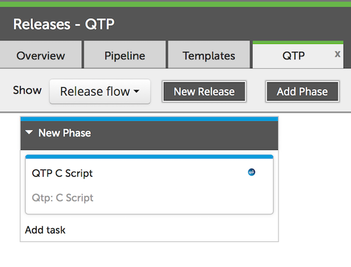
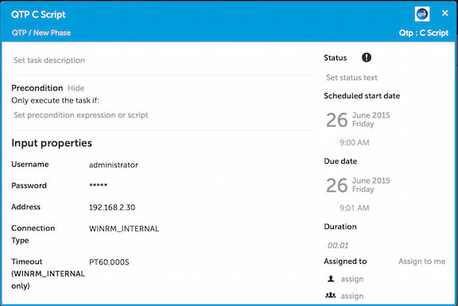

# xlr-qtp-plugin
### Intro 
 
QuickTest Professional (QTP) is now known as HP Unified Functional Testing.  This plugin should work with either product to support the execution of test sets via the products Visual Basic Script (VBS) interface.  The plugin supports a script block that allows you to enter VBS to be executed on the QTP server.

### Example XLR Template

QTP Tests can be executed via VBS in a single step.  One VBS script could start one test or a series of tests.  From the XL Release Template this can show up as a single step. 



The VBS can set an exit code which XLR will use to interpert if the step was executed correctly.  You can also use this exit code in your VBS to let XLR if it should continue with the release.  If you VBS examines the test results and determines that the results should stop the release a non-zero exit code will stop XL Release from continuing.  This can be useful in automated releases to stop the processing or to begin a roll back release.

### QTP Step Configuration

The QTP step is designed to be executed on a Windows server using WinRM.  This plugin takes the usual WinRM configuration parameters as well as a remote path and a VBS script.  The XL Rlease step looks like the following:



An example of VBS that might be useful is as follows:


````
Dim qtApp
Dim qtTest

'Create the QTP Application object
Set qtApp = CreateObject("QuickTest.Application") 

'If QTP is notopen then open it
If  qtApp.launched <> True then 

qtApp.Launch 

End If 

'Make the QuickTest application visible
qtApp.Visible = True

'Set QuickTest run options
'Instruct QuickTest to perform next step when error occurs

qtApp.Options.Run.ImageCaptureForTestResults = "OnError"
qtApp.Options.Run.RunMode = "Fast"
qtApp.Options.Run.ViewResults = False

'Open the test in read-only mode
qtApp.Open "C:\Program Files\HP\QuickTest Professional\Tests\trial", True 

'set run settings for the test
Set qtTest = qtApp.Test

'Instruct QuickTest to perform next step when error occurs
qtTest.Settings.Run.OnError = "NextStep" 

'Run the test
qtTest.Run

'Check the results of the test run
MsgBox qtTest.LastRunResults.Status

' Close the test
qtTest.Close 

'Close QTP
qtApp.quit

'Release Object
Set qtTest = Nothing
Set qtApp = Nothing
````

The QTP step returns the standard out, standard error and exit code from the script.  You can use this information later in your release template to make decisions and manage the release.
